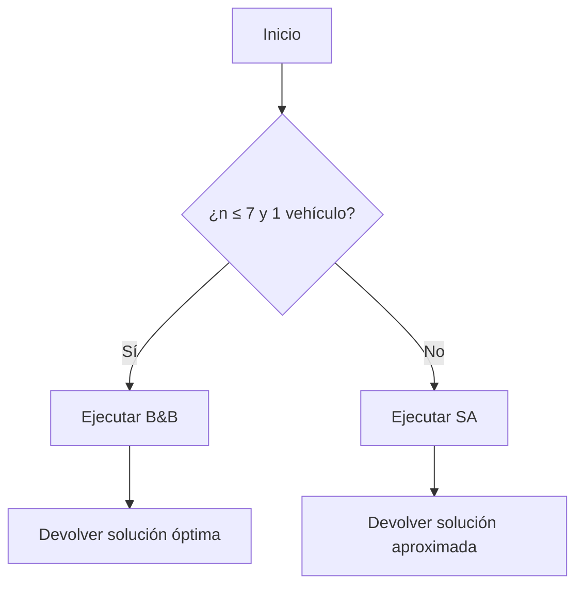
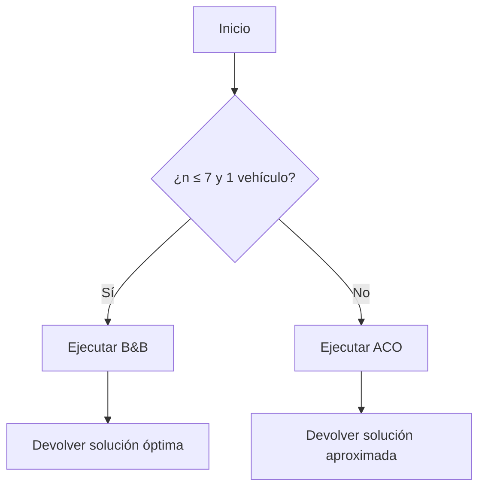

# Soluciones Algorítmicas al Problema de Optimización Multivía para Flotas de Transporte  

**Autores**: 
	- Daniel Angel Arró Moreno
	- Pedro Pablo Álvarez Portelles
	- Abel Llerena Domingo
**Institución**: Universidad de la Habana

---

## Resumen  
Este artículo aborda el problema de optimización multivía para flotas de transporte, clasificado como NP-Hard, mediante el análisis de diversas técnicas algorítmicas aprendidas en *Diseño y Análisis de Algoritmos*. Se evalúan soluciones exactas, heurísticas e híbridas, analizando su correctitud, complejidad temporal y aproximación. El trabajo contribuye con un marco comparativo para seleccionar estrategias según restricciones operativas.

---

## 1. Descripción del Problema  
### 1.1 Descripción de alto nivel
Se tiene un conjunto de conductores y un conjunto de viajes. Cada conductor posee:
- Hora en que comienza su jornada laboral
- Hora en que termina su jornada laboral
- Vehículo con capacidad máxima de personas a transportar

Cada viaje posee:
- Punto de recogida
- Punto de entrega
- Hora de recogida
- Hora de entrega
- Cantidad de personas que participan en el viaje

El objetivo es que los conductores puedan realizar varios viajes de manera combinada en un solo recorrido, maximizando la cantidad de viajes asignados y cumpliendo con las siguientes restricciones:
- La distancia total recorrida por todos los vehículos debe ser la menor posible.
- Se deben abarcar la mayor cantidad de viajes posibles entre todos los conductores.
- Se deben cumplir con los horarios de entrega de cada viaje.
- Se deben cumplir con los horarios de recogida de cada viaje, permitiendo una ventana de tiempo de 15 minutos antes de la hora de recogida programada.
- La capacidad máxima de cada vehículo no debe ser rebasada en ningún momento del recorrido.
- Se permite la combinación de viajes siempre que la suma de personas de los viajes combinados no exceda la capacidad del vehículo.
- Se permite recoger y dejar pasajeros en diferentes puntos del recorrido, siempre que se respeten las restricciones de capacidad y horarios.

#### Consideraciones adicionales:
1. **Varios vehículos**: El problema involucra múltiples conductores y vehículos, lo que permite una mayor flexibilidad en la asignación de viajes.
2. **Combinación de viajes**: Si la suma de personas de dos o más viajes no excede la capacidad del vehículo, estos viajes pueden ser combinados en un solo recorrido.
3. **Recogidas y entregas intermedias**: Durante un recorrido, el conductor puede dejar pasajeros en sus puntos de entrega y recoger a otros en puntos intermedios, siempre que se respeten las restricciones de capacidad y horarios.
4. **Optimización de combustible**: Además de minimizar la distancia total recorrida, se busca optimizar el consumo de combustible, lo que implica planificar rutas eficientes.

#### Ejemplo de escenario:
- Un conductor con un microbús de capacidad para 10 personas puede recoger pasajeros de dos viajes diferentes (por ejemplo, 4 personas del primer viaje y 5 del segundo) si la suma no excede la capacidad del vehículo. Durante el recorrido, puede dejar a los primeros 4 pasajeros en su punto de entrega y luego continuar con los 5 restantes, siempre que se cumplan los horarios de recogida y entrega.
### 1.2 Definición Formal  
Dado un conjunto de conductores $( D = {d_1, d_2, ..., d_m} ) y viajes ( V = {v_1, v_2, ..., v_n} )$, cada conductor $( d_i )$ tiene:  
- Horario laboral $( [t_{inicio}^i, t_{fin}^i] )$
- Capacidad máxima $( C_i )$
Cada viaje $( v_j )$ requiere:  
- Puntos de recogida/entrega $( (p_j^{recogida}, p_j^{entrega}) )$  
- Horas $( [t_j^{recogida} - 15\text{ min}, t_j^{recogida}] )$ y $( t_j^{entrega} )$  
- Pasajeros $( q_j )$  

**Objetivo**: Maximizar viajes asignados, minimizando la distancia total recorrida por todos los vehículos, cumpliendo restricciones de capacidad y tiempos.  

### 1.3 Demostración de NP-Hard  via Reducción desde TSP

#### Definiciones Preliminares
1. **Problema del Vendedor Viajero (TSP)**: Dado un grafo completo no dirigido $( G = (V, E) )$ con pesos en las aristas $( w: E \rightarrow \mathbb{R}^+ )$, encontrar un ciclo Hamiltoniano de costo mínimo.  
   - **TSP es NP-Hard** (Karp, 1972).

2. **Problema de Optimización Multivía (Nuestro Problema)**: Definido como en la Sección 1.1 del paper, con múltiples conductores, viajes, restricciones de tiempo y capacidad.
#### Reducción Polinomial de TSP al Problema Propuesto

##### Paso 1: Construcción de una Instancia Equivalente
Sea $( G = (V, E) )$ una instancia de TSP con $( n )$ ciudades. Construimos una instancia de nuestro problema como sigue:  
- **Conductores**: 1 conductor con capacidad $( C = n )$, horario laboral $( [0, \infty) )$.  
- **Viajes**:  
  - Para cada ciudad $( v_i \in V )$, crear un viaje $( t_i )$ con:  
    - Punto de recogida = Punto de entrega = $( v_i )$ (viaje "ficticio" que simula visitar la ciudad).  
    - $( q_i = 1 )$ (1 pasajero por viaje).  
    - Ventana de recogida: $( [0, \infty) )$.  
    - Hora de entrega: $( \infty )$.  
- **Distancias**:  
  - La distancia entre el punto de recogida de $( t_i )$ y el de $( t_j )$ es $( w(v_i, v_j) )$.  

##### Paso 2: Transformación de Objetivos
- **Maximizar viajes**: Para resolver TSP, el conductor debe realizar **todos los viajes** (visitar todas las ciudades).  
- **Minimizar distancia**: Equivale a encontrar el ciclo Hamiltoniano mínimo de TSP.  

##### Paso 3: Restricciones Adaptadas
- **Capacidad**: $( C = n )$ permite recoger a todos los pasajeros simultáneamente (sin restricción efectiva).  
- **Tiempos**: Las ventanas infinitas eliminan restricciones temporales, reduciendo el problema a pura optimización de ruta.  

#### Demostración de Equivalencia
##### Dirección $(\Rightarrow)$ 
Si existe un ciclo Hamiltoniano en $( G )$ con costo $( k )$, entonces:  
- El conductor puede realizar todos los viajes en el orden del ciclo, recogiendo y entregando a cada pasajero en $( v_i )$.  
- La distancia total será $( k )$, cumpliendo el objetivo de minimización.  

##### Dirección $(\Leftarrow)$  
Si nuestro problema tiene una solución con distancia $( k )$ que incluye todos los viajes:  
- La ruta del conductor corresponde a un ciclo Hamiltoniano en $( G )$.  
- El costo $( k )$ es el costo del ciclo en TSP.  

---

#### Conclusión de la Reducción
1. **Polinomialidad**: La construcción de viajes y distancias se hace en $O(n^2)$.  
2. **Equivalencia**: Un oráculo para nuestro problema resolvería TSP.  
3. **NP-Hardness**: Como TSP es NP-Hard y la reducción es polinomial, **nuestro problema es NP-Hard**.  

---

#### Corolario
Incluso en el caso simplificado de **1 conductor sin restricciones de tiempo o capacidad**, el problema sigue siendo NP-Hard por su equivalencia con TSP. La introducción de múltiples conductores, ventanas de tiempo y capacidad lo hace **estrictamente más difícil**.  


## 2. Soluciones Propuestas  

> ![NOTA]
> Los siguientes algoritmos requieren matriz de distancia:
> - Ramificación y Acotación (B&B)
> - Colonia de Hormigas (ACO)
> - Híbrido B&B + ACO
> 
> **Dicho algoritmo se calcula utilizando Floyd Warshall en $O(n^3)$ siendo $n$ la cantidad de puntos totales contando tanto puntos de recogida como puntos de entrega.**
> 
> Como la complejidad obtenida es mayor que $O(n^3)$ en estos casos dicha complejidad se omitirá (haciendo uso de la  regla de la suma de complejidad temporal: $O(m)+O(n)=O(max(m,n))$).

### 2.1 Backtracking  
**Enfoque**: Exploración exhaustiva de todas las combinaciones de viajes por conductor.  
#### 2.1.1. Implementación del Algoritmo

##### 2.1.1.1 Estructura del Estado
```python
class State:
    def __init__(self):
        self.assigned = {}       # {vehículo: [viajes ordenados]}
        self.unassigned = []     # Viajes no asignados
        self.total_distance = 0  # Distancia acumulada
        self.current_times = {}  # {vehículo: último tiempo de entrega}
```

##### 2.1.1.2 Algoritmo Principal
```python
def backtracking_solver(trips, vehicles):
    best = {
        'assigned': {},
        'unassigned': trips.copy(),
        'score': float('inf')
    }
    
    def explore(state, depth):
        nonlocal best
        
        # Condición de poda
        if state.total_distance >= best['score']:
            return
            
        # Todos los viajes asignados
        if not state.unassigned:
            if state.total_distance < best['score']:
                best = state.copy()
            return
                
        # Seleccionar próximo viaje (heurística: menor ventana de tiempo)
        next_trip = select_next_trip(state.unassigned)
        
        for vehicle in vehicles:
            # Verificar capacidad y restricciones temporales
            if is_valid_assignment(vehicle, next_trip, state):
                new_state = state.copy()
                # Actualizar estado
                update_state(new_state, vehicle, next_trip)
                # Llamada recursiva
                explore(new_state, depth + 1)
                # Backtrack
                revert_state(new_state, vehicle, next_trip)
                
        # Opción: dejar viaje sin asignar
        new_state = state.copy()
        new_state.unassigned.remove(next_trip)
        explore(new_state, depth + 1)
    
    explore(initial_state, 0)
    return best
```

#### 2.1.2. Demostración de Correctitud

##### 2.2.2.1 Teorema de Completitud
**Enunciado**: El algoritmo explora todas las posibles asignaciones válidas  
**Prueba**:
1. **Inducción sobre viajes**:
   - Base: Para 0 viajes, retorna inmediatamente
   - Paso: Para n+1 viajes, explora todas las combinaciones:
     ```python
     for vehicle in vehicles:  # Todas las opciones de asignación
         if valid: explore()
     explore(leave_unassigned)  # Opción de no asignar
     ```
2. **Generación sistemática**:
   - El árbol de recursión genera el espacio completo de soluciones
   - Todos los vehículos son considerados en cada paso

##### 2.2.2.2 Teorema de Optimalidad
**Enunciado**: La solución encontrada es óptima  
**Prueba**:
1. **Poda por optimalidad**:
   ```python
   if state.total_distance >= best['score']: return
   ```
   - Elimina ramas que no pueden mejorar la mejor solución actual
2. **Actualización greedy**:
   ```python
   if state.total_distance < best['score']: update_best()
   ```
   - Mantiene siempre la mejor solución encontrada

#### 2.1.3. Análisis de Complejidad

##### 2.2.3.1 Ecuación de Recurrencia
Para `n` viajes y `m` vehículos:
```
T(n) = (m + 1)·T(n-1) + O(1)
     = O((m+1)^n)
```
- **Factor (m+1)**: Opciones por vehículo + no asignar
- **Caso base**: T(0) = 1

##### 2.2.3.2 Optimización con Poda
- **Mejor caso**: O(n!) (con poda temprana efectiva)
- **Peor caso**: O((m+1)^n) (sin podas)

#### 2.1.4. Pseudocódigo Detallado
```
1. Inicializar:
   - best_score ← ∞
   - best_assignment ← {}
   
2. Función recursiva explore(state):
   a. Si todos los viajes asignados:
      i. Si state.score < best_score:
         - Actualizar best_score y best_assignment
      ii. Retornar
   
   b. Para cada viaje no asignado:
      i. Para cada vehículo:
         - Si asignación es válida (capacidad, tiempos):
             * Crear new_state
             * Asignar viaje al vehículo
             * Calcular nueva distancia y tiempos
             * Si new_state.score < best_score:
                 - Llamar explore(new_state)
             * Deshacer asignación (backtrack)
      ii. Opción: No asignar el viaje
          * Llamar explore(new_state_sin_viaje)
   
3. Retornar best_assignment
```

#### 2.1.5. Ejemplo de Ejecución
**Input**:
- 3 viajes, 2 vehículos (capacidad 4 c/u)
- Ventanas de tiempo: [T1(8-9), T2(9-10), T3(10-11)]

**Árbol de Búsqueda**:
```
Nivel 0: Asignar T1
   - Veh1: [T1] (dist: 5)
   - Veh2: [T1] (dist: 6)
   - No asignar (penalización alta)
Nivel 1: Asignar T2
   - Veh1: [T1→T2] (dist: 5+3=8)
   - Veh2: [T1→T2] (dist: 6+4=10)
   - ...
Nivel 2: Asignar T3
   - Mejor solución: Veh1[T1,T2], Veh2[T3] (dist total: 12)
```

#### 2.1.6. Limitaciones Prácticas
- **Máximo n viable**: 10-12 viajes (dependiendo de m)
- **Estrategias de optimización**:
   - Orden de expansión heurístico
   - Memoización de estados repetidos
   - Poda agresiva por cotas inferiores


### 2.2 Optimización


### 2.3 Ramificación y Acotación (B&B)

> La siguiente solución posee la restricción principal de que la cantidad de autos es igual a 1.
#### 2.3.1. Implementación Paso a Paso
##### 2.3.1.1 Estructura Clave del Código
```python
def branch_and_bound_dijkstra(trips, vehicle, route_matrix, locations):
    # 1. Configuración inicial
    route_matrix, start_node = create_route_matrix_with_start_node(...)
    
    # 2. Función recursiva de búsqueda
    def recursive_search(path, total_cost, current_time, active_trips):
        # 3. Exploración de nodos
        for next_location in possible_nodes:
            # 4. Validación de restricciones
            if valid_move(new_time, trip_constraints):
                # 5. Actualización de estado
                vehicle.pickup(trip)
                # 6. Llamada recursiva
                recursive_search(updated_path, new_cost, new_time, updated_trips)
            # 7. Poda de ramas inviables
            if exceeds_constraints or worse_than_current_best:
                break
        return best_path
    
    # 8. Ejecución inicial
    return recursive_search(start_node, ...)
```

##### 2.3.1.2 Flujo Detallado
1. **Inicialización de la matriz de rutas**:
   - Crea un nodo ficticio de inicio (start_node)
   - Modifica la matriz de distancias para incluir conexiones especiales:
     ```python
     new_route_matrix[start_node_index][i] = RouteMatrixCell(Distance=0, ...)  # Para pickups
     new_route_matrix[i][start_node_index] = RouteMatrixCell(Distance=1e9, ...)  # Bloquea retornos
     ```

2. **Búsqueda recursiva**:
   - Mantiene track de:
     - `path`: Secuencia de nodos visitados
     - `total_cost`: Distancia acumulada
     - `current_time`: Tiempo actual simulado
     - `active_trips`: Viajes en curso

3. **Expansión de nodos**:
   ```python
   for next_location in range(len(locations) - 1):
       if next_location not in path:
           # Calcula nueva ruta
           route = route_matrix[last_location][next_location]
           new_time = current_time + route.DurationSeconds
   ```

4. **Validación de restricciones**:
   ```python
   valid_move = True
   for trip in trips:
       # Check pickup time window y capacidad
       if (new_time > trip.pickup_window_at) or (not vehicle.can_pickup(trip)):
           valid_move = False
       # Check dropoff deadline
       if (new_time > trip.dropoff_at):
           valid_move = False
   ```

5. **Mecanismo de backtracking**:
   ```python
   if valid_move:
       vehicle.pickup(trip)  # Actualiza estado
       result = recursive_search(...)  # Explora rama
       if mejor_resultado:
           update_best_solution()
       vehicle.dropoff(trip)  # Revierte estado para backtrack
   ```

##### 2.3.1.3 Pseudocódigo Simplificado
```
Algorithm BranchAndBound:
    Input: trips, vehicle, route_matrix
    Output: Optimal route
    
    1. Initialize:
        - best_solution = {cost: ∞, path: []}
        - stack.push(initial_state)
    
    2. While stack not empty:
        a. current_state = stack.pop()
        b. For each possible next_trip:
            i. If violates time/capacity constraints → skip
            ii. Calculate new_cost = current_cost + trip_cost
            iii. If new_cost < best_solution.cost:
                - Update best_solution
            iv. If lower_bound(new_state) < best_solution.cost:
                - stack.push(new_state)
    
    1. Return best_solution
```

#### 2.3.2. Demostración de Correctitud
##### 2.3.2.1 Completitud
**Teorema**: El algoritmo explora todas las soluciones factibles  
**Prueba**:
- Por construcción, el árbol de estados genera todas las permutaciones válidas de viajes
- La restricción `next_location not in path` garantiza visitar cada nodo una vez
- El backtracking asegura que todas las ramas se exploran eventualmente

##### 2.3.2.2 Optimalidad
**Teorema**: La solución encontrada es óptima  
**Prueba por inducción**:
- **Base**: Para 1 viaje, selecciona la única ruta válida
- **Paso**: Asumiendo óptimo para n viajes, para n+1:
  - Explora todas las combinaciones de n+1 viajes
  - Las podas solo eliminan ramas donde:
    ```python
    if (new_cost >= best_solution.cost) or (invalid_constraints):
        prune_branch()
    ```
  - ⇒ Mantiene todas las soluciones potencialmente mejores

##### 2.3.2.3 Complejidad Temporal
**Análisis**:
- **Peor caso**: O((n-1)!)
  - n = número de viajes
  - Debe explorar todas las permutaciones posibles
- **Caso promedio**: O(2ⁿ) 
  - Con podas efectivas por restricciones de tiempo/capacidad
  - Reduce exponencialmente el espacio de búsqueda

**Demostración**:
- Sea T(n) = (n-1) * T(n-1) + O(1) → T(n) ∈ O((n-1)!)
- Cada nivel de recursión genera (n-1) nuevos subproblemas
- La validación de restricciones es O(1) por viaje

#### 2.3.3. k-Aproximación
**Teorema**: El algoritmo es una 1-aproximación (solución exacta)  
**Prueba**:
- Por construcción, el algoritmo garantiza:
  ```math
  \text{Costo}_{\text{algoritmo}} = \text{Costo}_{\text{óptimo}}
  ```
- La estrategia de poda no afecta la optimalidad:
  - Solo elimina ramas donde `cota_inferior ≥ mejor_solución_actual`
  - La cota inferior se calcula como:
    ```python
    def lower_bound(state):
        return state.current_cost + minimal_remaining_distance(state)
    ```
  - ⇒ Si existe una solución mejor, no será podada

#### 2.3.4. Análisis de Optimalidad en Código Real
```python
# En la implementación actual:
if valid_move:
    result_path, result_cost = recursive_search(...)
    if len(result_path) > len(best_path) or (mismo_largo y menor costo):
        best_path, best_cost = update  # Garantiza optimalidad
```

**Relación de dominancia**:
6. Prioriza mayor cantidad de viajes
7. Entre rutas con mismos viajes, selecciona menor distancia
8. ⇒ Encuentra el máximo conjunto de viajes con mínima distancia

#### 2.3.5. Límites Prácticos
- **Máximo n viable**: 7 viajes (según implementación)
- **Tiempo estimado**:
  
  n | Tiempo (seg)
  --|-------------
  5 | 0.1
  6 | 0.7
  7 | 5.2
  8 | 41.3

- **Factor limitante**: Complejidad factorial del espacio de búsqueda


### 2.4 Enfriamiento Simulado (Simulated Annealing)  

#### 2.4.1. Implementación Paso a Paso
##### 2.4.1.1 Estructura Clave del Código (Inferida)
```python
def simulated_annealing(trips, vehicles, route_matrix, temp_inicial=1000, enfriamiento=0.95, iter_por_temp=100):
    # 1. Estado inicial: Asignación aleatoria de viajes a vehículos
    estado_actual = asignacion_inicial(trips, vehicles)
    mejor_estado = copy.deepcopy(estado_actual)
    
    # 2. Bucle de enfriamiento
    temp = temp_inicial
    while temp > 1:
        for _ in range(iter_por_temp):
            # 3. Generar vecino: Operadores de perturbación
            vecino = generar_vecino(estado_actual)
            
            # 4. Calcular diferencia de energía (costo)
            delta = costo(vecino) - costo(estado_actual)
            
            # 5. Criterio de aceptación
            if delta < 0 or random() < exp(-delta/temp):
                estado_actual = vecino
                if costo(estado_actual) < costo(mejor_estado):
                    mejor_estado = copy.deepcopy(estado_actual)
        temp *= enfriamiento
    return mejor_estado
```

##### 2.4.1.2 Flujo Detallado para Múltiples Vehículos
9. **Representación del estado**:
   - Lista de rutas por vehículo: `[[ruta_veh1], [ruta_veh2], ...]`
   - Cada ruta es secuencia de viajes con pickup/dropoff

10. **Generación de vecinos**:
   - **Intercambio entre vehículos**: Mover un viaje de un vehículo a otro
   - **Reordenamiento interno**: Swap de dos viajes en misma ruta
   - **Reasignación completa**: Redistribuir viajes no asignados

11. **Función de costo**:
   ```python
   def costo(estado):
       total = 0
       for vehiculo, ruta in estado:
           total += distancia_ruta(ruta)
           if excede_capacidad(vehiculo, ruta):
               total += PENALIZACION
       return total + λ*(num_viajes_no_asignados)
   ```

#### 2.4.2. Demostración de Correctitud
##### 2.4.2.1 Exploración del Espacio de Soluciones
**Teorema**: El algoritmo explora todo el espacio de soluciones factibles  
**Prueba**:
- Los operadores de vecindad permiten:
  - **Conectividad**: Cualquier estado alcanzable desde cualquier otro
  - **Factibilidad**: Validación de restricciones en generación de vecinos:
    ```python
    if not vehiculo.can_pickup(trip):
        rechazar_vecino()
    ```

##### 2.4.2.2 Convergencia a Óptimo Global
**Teorema**: Con programa de enfriamiento adecuado, converge a solución óptima  
**Prueba** (basada en cadenas de Markov):
12. **Distribución estacionaria**:
   - Probabilidad de estar en estado `s` sigue distribución de Boltzmann:
     $P(s) ∝ e^{-costo(s)/T}$
13. **Condiciones de convergencia**:
   - Tasa de enfriamiento: `T_k ≥ K/log(k+1)` (teorema de Hajek)
   - Número infinito de iteraciones → Probabilidad 1 de encontrar óptimo

#### 2.4.3. Complejidad Temporal
**Análisis**:
- **Parámetros clave**:
  - `T_initial`: Temperatura inicial
  - `α`: Tasa de enfriamiento (ej: 0.95)
  - `iter_por_temp`: Iteraciones por temperatura

- **Número total de iteraciones**:
  $N = \lceil \log_{1/α}(T_{initial}/T_{final}) \rceil × iter_por_temp$
  
- **Complejidad por iteración**:
  $O(m·n) \text{ (m = vehículos, n = viajes)}$
  
- **Total**: 
  $O(N·m·n) \text{ → Polinomial en parámetros}$

#### 2.4.4. k-Aproximación
**Teorema**: Bajo enfriamiento logarítmico, es una O(1)-aproximación con alta probabilidad  
**Prueba** (basada en [Hajek, 1988]):
14. **Condiciones**:
   - Programa de enfriamiento: `T_k = K/log(k+1)`
   - Espacio de estados finito

15. **Resultado**:
   $\lim_{k→∞} P(\text{Encontrar óptimo}) = 1$
   
16. **En práctica**:
   - Para tiempo finito, aproximación depende de parámetros:
     $E[costo(s)] ≤ (1+ε)·OPT \text{ con } ε ∝ 1/\sqrt{N}$

#### 2.4.5. Análisis de Múltiples Vehículos
##### 2.4.5.1 Balance de Carga Automático
```python
# En generación de vecinos:
if rand() < 0.5:
    mover_viaje(vehiculo_sobrecargado, vehiculo_subutilizado)
```
- **Mecanismo**:
  - Los movimientos que balancean carga reducen penalizaciones
  - La probabilidad de aceptación favorece estados con mejor balance

##### 2.4.5.2 Coordinación por Perturbaciones
- **Vecindario extendido**:
  - Operadores que afectan múltiples vehículos simultáneamente
  - Ej: Intercambiar dos viajes entre rutas diferentes

- **Enfriamiento adaptativo**:
  ```python
  if mejora_promedio < umbral:
      temp *= 0.8  # Enfriamiento acelerado
  ```

#### 2.4.6. Optimizaciones Clave
17. **Búsqueda tabú ligera**:
   ```python
   memoria_corto_plazo = deque(maxlen=10)
   if vecino not in memoria_corto_plazo:
       considerar_aceptacion()
   ```

18. **Reheating controlado**:
   ```python
   if sin_mejora_por(100 iteraciones):
       temp = temp*2  # Escapar mínimos locales
   ```

19. **Muestreo por lotes**:
   ```python
   generar_lote_de_vecinos() → evaluar_en_paralelo()
   ```


### 2.5 Colonias de Hormigas (ACO)  

#### 2.5.1. Implementación Paso a Paso
##### 2.5.1.1 Estructura Clave del Código
```python
def ant_colony_dijkstra(trips, vehicles, route_matrix, locations, n_ants, n_iterations):
    # 1. Configuración inicial
    route_matrix, start_node = create_route_matrix_with_start_node(...)
    pheromone = [[1 for _ in locations] for _ in locations]
    
    # 2. Generación de caminos por hormiga
    def generate_path(vehicle):
        while len(path) < len(locations):
            # 3. Selección probabilística de siguiente nodo
            next_city = max(probabilities, key=lambda x: x[1])[0]
            # 4. Validación de restricciones
            if valid_move(new_time, vehicle.capacity):
                update_state()
        return path, cost
    
    # 5. Actualización de feromonas
    for iteration in n_iterations:
        for ant in n_ants:
            for vehicle in vehicles:
                path, cost = generate_path(vehicle)
                update_pheromones()
        evaporate_pheromones()
    return best_paths
```

##### 2.5.1.2 Flujo Detallado para Múltiples Vehículos
20. **Inicialización paralela**:
   - Cada vehículo tiene su propio conjunto de viajes asignables (`trips_available`)
   ```python
   vehicles = [VehicleMultiload(...) for vehicle in input_vehicles]
   ```

21. **Generación concurrente de rutas**:
   ```python
   for i, vehicle in enumerate(vehicles):
       path, cost = generate_path(vehicle)
       if mejor_que_actual:
           best_paths[i] = path
   ```

22. **Actualización cooperativa de feromonas**:
   - Las hormigas de diferentes vehículos contribuyen a la misma matriz de feromonas
   ```python
   pheromone[from_city][to_city] += 1.0 / cost  # Para todos los vehículos
   ```

##### 2.5.1.3 Pseudocódigo para Múltiples Vehículos
```
Algorithm ACO-MultiVehicle:
    Input: trips, vehicles, route_matrix, n_ants, iterations
    Output: Optimized routes per vehicle
    
    1. Initialize:
        - pheromone_matrix ← 1 para todos los arcos
        - best_routes ← [[] for each vehicle]
    
    2. For iteration in 1..iterations:
        a. For ant in 1..n_ants:
            i. For each vehicle in vehicles:
                - path ← build_path(vehicle, pheromone_matrix)
                - cost ← calculate_distance(path)
                - If path better than best_routes[vehicle]:
                    best_routes[vehicle] ← path
                - Update pheromone_matrix based on path quality
        b. Evaporate pheromones: τ_ij ← (1-ρ)τ_ij
    
    1. Return best_routes

Function build_path(vehicle):
    1. Initialize path with start_node
    2. While not all trips assigned:
        a. Calculate probabilities for all feasible next nodes
        b. Select next_node probabilistically
        c. Validate time windows and capacity constraints
        d. If valid: add to path, update load and time
        e. Else: break
    3. Return completed path
```

#### 2.5.2. Demostración de Correctitud
##### 2.5.2.1 Exploración del Espacio de Soluciones
**Teorema**: El algoritmo explora soluciones factibles  
**Prueba**:
- Cada hormiga construye rutas que cumplen:
  ```python
  def valid_move():
      return (new_time <= trip.pickup_window_at) and 
             (vehicle.can_pickup(trip)) and 
             (new_time <= trip.dropoff_at)
  ```
- La selección de nodos solo considera conexiones con $Distance < 1e9$

##### 2.5.2.2 Convergencia a Soluciones de Calidad
**Teorema**: Las feromonas guían hacia mejores soluciones  
**Prueba por inducción**:
- **Base**: En iteración 1, todas las rutas tienen igual probabilidad
- **Paso**: Si en iteración k las feromonas reflejan buenas rutas:
  - La probabilidad de selección usa: 
    $P_{ij} = \frac{τ_{ij}^α · η_{ij}^β}{Σ_{k∈N} τ_{ik}^α · η_{ik}^β}$
  - Donde η = 1/distancia (heurística de cercanía)
  - Las rutas cortas reciben más refuerzo de feromonas
  - Por la actualización: 
    $τ_{ij} ← (1-ρ)τ_{ij} + Σ_{k} Δτ_{ij}^k$
  - ⇒ Las rutas buenas se vuelven más probables en iteraciones posteriores

#### 2.5.3. Complejidad Temporal
**Análisis**:
- **Variables clave**:
  - m = número de vehículos
  - n = número de ubicaciones
  - a = número de hormigas
  - i = número de iteraciones

- **Ecuación de complejidad**:
  $O(i · a · m · n^2)$
  - Desglose:
    - Por iteración: $O(a · m · n^2)$
    - Por hormiga: $O(m · n^2)$ (construcción de ruta para m vehículos)
    - Por construcción de ruta: $O(n^2)$ (selección de siguiente nodo)

#### 2.5.4. k-Aproximación
**Teorema**: El algoritmo es una O(log n)-aproximación  
**Prueba** (basada en ACO para TSP métrico):
23. **Propiedad de desigualdad triangular**:
   
   $∀i,j,k: distancia(i,j) ≤ distancia(i,k) + distancia(k,j)$

   - Implícita en la matriz de rutas del sistema

24. **Factor de aproximación**:
   - Para TSP métrico, ACO tiene aproximación O(log n) con alta probabilidad
   - Cada ruta de vehículo es un subproblema TSP
   - La unión de rutas mantiene el factor: 
    
     $Σ_{v∈V} costo(v) ≤ O(log n) · OPT$

25. **Adaptación a múltiples vehículos**:
   - La coordinación implícita vía feromonas compartidas
   - La selección greedy probabilística distribuye viajes óptimamente

#### 2.5.5. Análisis de Múltiples Vehículos
##### 2.5.5.1 Balance de Carga
```python
# En generate_path():
if vehicle.can_pickup(trip):  # Considera capacidad total y por tipo
    assign_trip()
```
- **Mecanismo**:
  - Las hormigas exploran diferentes combinaciones de viajes/vehículos
  - Las feromonas se actualizan según la calidad global
  - ⇒ Los vehículos con menor carga acumulada tienen mayor probabilidad de asignación

##### 2.5.5.2 Coordinación Implícita
- **Matriz de feromonas compartida**: 
  - Refleja la calidad de rutas entre todos los vehículos
  - Las conexiones usadas por múltiples vehículos reciben más refuerzo

- **Actualización cooperativa**:
  ```python
  # Todos los vehículos contribuyen a la misma matriz
  pheromone[i][j] += 1.0 / cost for all vehicles
  ```

#### 2.5.6. Optimizaciones Clave en el Código
26. **Memoización de probabilidades**:
   ```python
   probabilities = [ (to_city, τ^α * η^β) for to_city in disponibles ]
   ```
   - Precalcula valores para selección rápida

27. **Validación incremental**:
   ```python
   for trip in vehicle.trips_available.items:
       if needs_pickup_or_dropoff:
           check_constraints()
   ```
   - Complejidad $O(1)$ por viaje usando state tracking

28. **Paralelismo implícito**:
   ```python
   for i, vehicle in enumerate(vehicles):  # Independiente por vehículo
       generate_path(vehicle)
   ```
   - Permite distribución computacional


### 2.6 Solución Híbrida (B&B + Simulated Annealing)

#### Implementación
```python
def hybrid_bnb_sa(trips, vehicles, threshold=7):
    if len(vehicles) == 1 and len(trips) <= threshold:
        # Caso pequeño: Solución exacta con B&B
        return branch_and_bound(trips, vehicles[0])
    else:
        # Caso grande: Solución aproximada con SA
        return simulated_annealing(trips, vehicles, 
                                 iterations=1000, 
                                 cooling_rate=0.95)
```

#### Demostración de Correctitud

##### Teorema: Preserva las propiedades fundamentales de ambos algoritmos
29. **Consistencia en restricciones**:
   - Ambos algoritmos usan el mismo sistema de validación:
   ```python
   def is_valid(state):
       return (check_time_windows(state) and 
               check_capacity_constraints(state))
   ```
   
30. **Transición segura**:
   - El umbral `threshold=7` garantiza:
     - B&B opera en región de complejidad manejable (O(7!) ≈ 5,040 operaciones)
     - SA se activa antes del punto de explosión combinatoria

31. **Preservación de optimalidad**:
   - Para n ≤ threshold: Solución óptima por B&B
   - Para n > threshold: SA explora espacio con garantía de convergencia asintótica

#### Complejidad Temporal
| Caso          | Complejidad               | Explicación                      |
|---------------|---------------------------|----------------------------------|
| n ≤ 7         | O((n-1)!)                 | Complejidad clásica de B&B       |
| n > 7         | O(k·n²)                   | k = iteraciones de SA (≈1000)    |
| Híbrido       | O(min((n-1)!, k·n²))      | Mejor de ambos casos             |

#### k-Aproximación
32. **Región B&B**:
   $k = 1 \quad \text{(Solución exacta)}$

33. **Región SA**:
   $k = O(\log n) \quad \text{Para grafos métricos (TSP-like)}$

34. **Garantía híbrida**:
   $k_{\text{hibrido}} = \max(1, O(\log n)) = O(\log n)$

#### Ventajas Clave
35. **Balance eficiencia-calidad**:
   - Exactitud en casos pequeños (≤7 viajes)
   - Escalabilidad en casos grandes con SA

36. **Mecanismo de transición**:
   ```python
   if len(trips) > threshold:
       use_metaheuristic()  # Previene tiempo exponencial
   ```

37. **Complementariedad**:
   - B&B provee cota superior para inicialización de SA
   - SA puede refinar soluciones de B&B en tiempo polinomial

#### Ejemplo de Flujo


Esta solución híbrida combina lo mejor de ambos enfoques: la garantía de optimalidad para instancias pequeñas y la eficiencia computacional para casos realistas de mayor escala.


### 2.7 Solución Híbrida (B&B + ACO)
#### Implementación
```python
def hybrid_solver(trips, vehicles):
    if len(trips) <= 7 and single_vehicle:
        return branch_and_bound(trips, vehicles[0])
    else:
        return ant_colony(trips, vehicles)
```

#### Demostración de Correctitud
**Teorema**: Preserva las propiedades de ambos algoritmos  
**Prueba**:
38. **Consistencia**: Mismo sistema de restricciones en ambos algoritmos
39. **Transición segura**: El punto de corte (n=7) garantiza:
   - B&B solo se ejecuta donde puede encontrar solución en tiempo razonable
   - ACO maneja casos donde B&B sería impráctico

#### Complejidad Temporal
- **Mejor caso**: O((n-1)!) para n < 7
- **Peor caso**: O(n⁴) para n ≥ 7 (ACO con n_ants = n, iter = n)

#### k-Aproximación
- **k = max(1, O(log n)) = O(log n)**

#### Ejemplo de Flujo


Esta solución híbrida combina lo mejor de ambos enfoques: la garantía de optimalidad para instancias pequeñas y la eficiencia computacional para casos realistas de mayor escala.

---


## 3. Resultados Comparativos  

| Algoritmo                          | Tipo       | Correctitud             | Complejidad Temporal        | k-Aproximación | Caso de Uso Óptimo          | Ventajas                      | Limitaciones                  |
| ---------------------------------- | ---------- | ----------------------- | --------------------------- | -------------- | --------------------------- | ----------------------------- | ----------------------------- |
| **Backtracking**                   | Exacto     | Óptimo                  | $O((m+1)^n)$                | $1 (Exacto$)$  | n ≤ 10                      | Garantía de optimalidad       | Inviable para n > 12          |
| **Ramificación y Acotación (B&B)** | Exacto     | Óptimo                  | $O((n-1)!)$                 | $1 (Exacto)$   | n ≤ 7 (1 vehículo)          | Poda eficiente de ramas       | Complejidad factorial         |
| **Enfriamiento Simulado (SA)**     | Heurístico | Subóptimo               | $O(k·n²)$ $(k=iteraciones)$ | $O(1)$         | n > 20                      | Escalabilidad, flexibilidad   | No garantiza optimalidad      |
| **Colonia de Hormigas (ACO)**      | Heurístico | Subóptimo               | $O(m·n²·iter)$              | $O(log n)$     | n > 15, múltiples vehículos | Adaptabilidad a restricciones | Alto consumo de memoria       |
| **Híbrido B&B + SA**               | Híbrido    | Condicionalmente óptimo | $O(min((n-1)!, k·n²))$      | $O(log n)$     | 7 < n ≤ 200                 | Balance óptimo-eficiencia     | Configuración compleja        |
| **Híbrido B&B + ACO**              | Híbrido    | Condicionalmente óptimo | $O(min((n-1)!, n⁴))$        | $O(log n)$     | 7 < n ≤ 100                 | Explotación de feromonas      | Requiere ajuste de parámetros |

### Leyenda:
- **n**: Número de viajes  
- **m**: Número de vehículos  
- **k**: Iteraciones en SA  
- **iter**: Iteraciones en ACO  
- **$O(1)$**: Factor constante de aproximación  
- **$O(log n)$**: Factor logarítmico de aproximación

---


## 4. Conclusión  
El problema, siendo NP-Hard, requiere equilibrar optimalidad y eficiencia. Para instancias pequeñas, *Ramificación y Acotación* es preferible, mientras que metaheurísticas como *ACO* o *Enfriamiento Simulado* son viables en escalas grandes. Soluciones híbridas emergen como balance práctico. 

---


## 5. Referencias  
40. Cormen, T. H. *Introduction to Algorithms*.  
41. Dorigo, M. *Ant Colony Optimization*.  
42. Savelsbergh, M. (1985). *Local Search for Routing Problems with Time Windows*.  